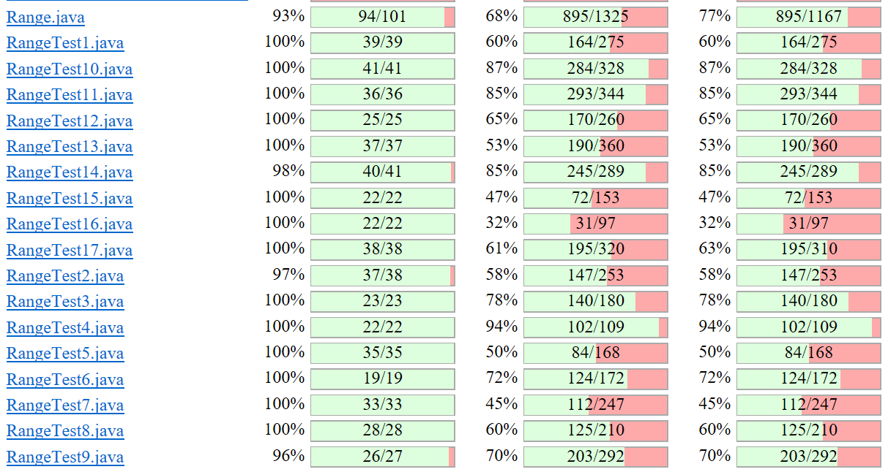
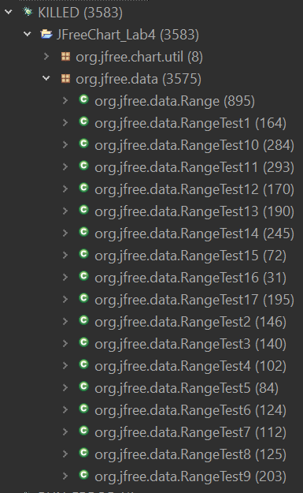
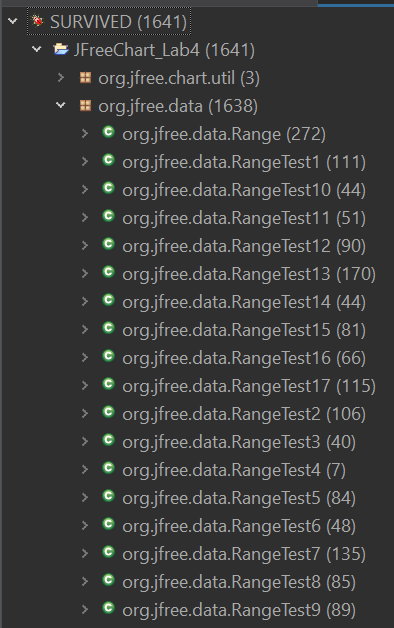
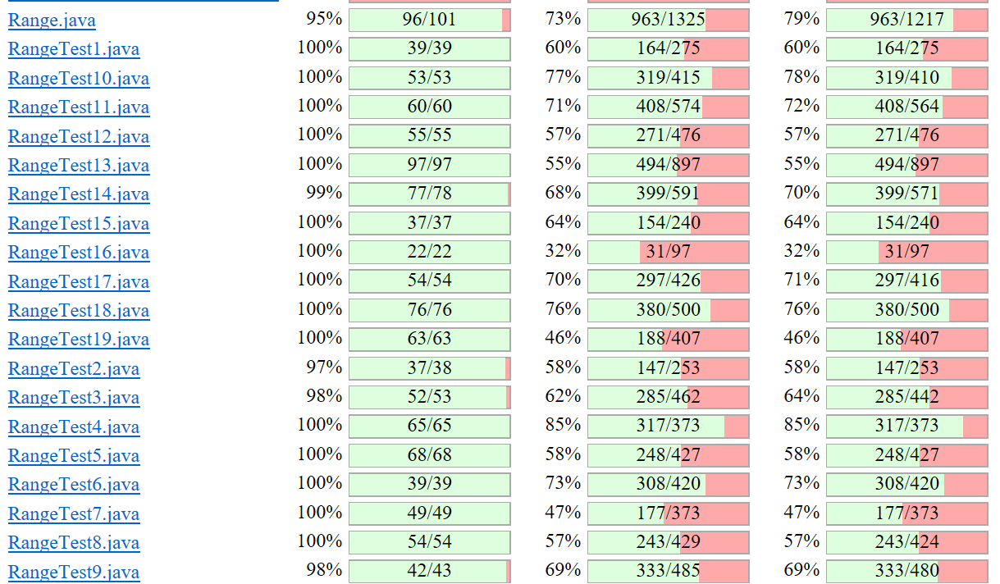
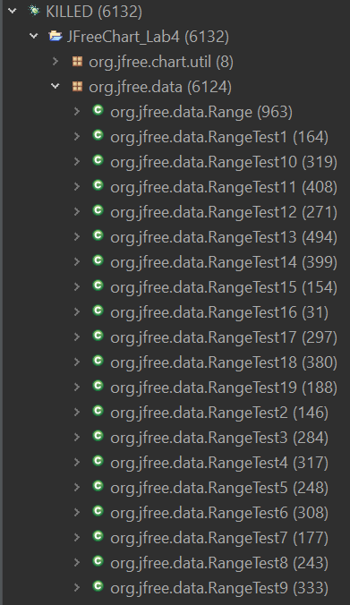
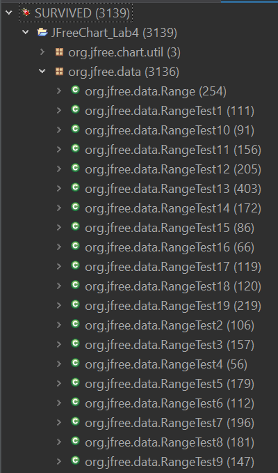

**SENG 637 - Dependability and Reliability of Software Systems**

**Lab. Report \#4 – Mutation Testing and Web app testing**

| Group \#:      |     |
| -------------- | --- |
| Student Names: |     |
|                |     |
|                |     |
|                |     |

# Introduction

# Analysis of 10 Mutants of the Range class 
- To examine 10 mutants generated by executing Pitest on the Range class, let us consider five distinct methods within the Range class. Within each method, we select two mutants and analyze how they were killed or not by the original test suite.
    * Method 01: getLowerBound():
        * Generated Mutant 01: Negated double field lower 
            * Mutation Status: Killed
            * Analysis of the mutant: This mutant negates the value of the 'lower' field in the Range class. That is, if a positive lower bound value is expected, this mutant would return a negative value instead.
            * Original test suite test case that likely killed this mutant: getLowerBoundWithNegativeRange()
        * Generated Mutant 02: replaced double return with 0.0d for org/jfree/data/Range::getLowerBound
            * Mutation Status: Killed
            * Analysis of the mutant: This mutant indicates that the method will always return 0.0, irrespective of what the actual lower bound of the range is. 
            * Original test suite test case that likely killed this mutant: getLowerBoundWithNegativeRange() since it expects a distinctly non-zero, negative value, making it impossible for the mutant to pass this test. 
    * Method 02: getCentralValue():
        * Generated Mutant 01: Replaced double division with multiplication 
            * Mutation Status: Killed
            * Analysis of the mutant: The expected operation for this method is division. And this mutant changes that operation to multiplication instead, clearly showing the stark difference between the two operations. 
            * Original test suite test case that likely killed this mutant: testCentralValueWithPositiveRange() and testCentralValueWithNegativeRange()
        * Generated Mutant 02: Substituted 2.0 with 1.0
            * Mutation Status: Killed
            * Analysis of the mutant: The expectation is the calculation of the average or the midpoint, and division by 2.0 is crucial for correctness and accuracy. But this mutant substitutes 2.0 with 1.0, thereby resulting in a calculation that doesn't halve the sum of the bounds, producing an incorrect result by not averaging the bounds.
            * Original test suite test case that likely killed this mutant: Even though all test cases are capable of killing this mutant since they all depend on the division by 2.0 for average calculation, there are two test cases: testCentralValueWithPositiveRange() and testCentralValueWithNegativeRange() that directly impacts the accuracy without the added complexities of extreme ranges or special conditions. 
    * Method 03: expand(Range range, double lowerMargin, double upperMargin):
        * Generated Mutant 01: Negated double local variable number 5 
            * Mutation Status: Survived
            * Analysis of the mutant: This mutant basically negates the fifth local variable. 
            * Original test suite test cases weren't able to kill this mutant. This may be due to the fact that there weren't any test cases that detected the calculation's intermediate step to pick up on the variable negation.
        * Generated Mutant 02: not equal to greater than
            * Mutation Status: Survived
            * Analysis of the mutant: This mutant basically replaces the comparison operator with a 'greater than' operator, thereby altering the logic of the conditional statements. 
            * Original test suite test cases weren't able to kill this mutant. This may be due to the fact that the test cases did not cover all the logical branches or edge cases that would be affected by this change. 
    * Method 04: scale(Range base, double factor):
        * Generated Mutant 01: negated conditional 
            * Mutation Status: Killed
            * Analysis of the mutant: This mutant negates the logic of the conditional statement, such as flipping the 'if' condition from true to false or vice versa. 
            * Original test suite test case that likely killed this mutant: testScaleByNegative() throws an exception when the scaling factor is negative and negating the condition results in failing the test, thereby killing the mutant.
        * Generated Mutant 02: Substituted 0.0 with 1.0
            * Mutation Status: Killed
            * Analysis of the mutant: This mutant alters the calculations that depend on a 0.0 value for the expected behaviour. 
            * Original test suite test case that likely killed this mutant: testScaleByZero() 
    * Method 05: equals(Object obj):
        * Generated Mutant 01: not equal to less or equal 
            * Mutation Status: Killed
            * Analysis of the mutant: This mutant changes the comparison operator to check for 'less than or equal to', basically inequality checks
            * Original test suite test case that likely killed this mutant: testDifferentLowerBound() and testDifferentUpperBound()
        * Generated Mutant 02: removed conditional - replaced equality check with false
            * Mutation Status: Killed
            * Analysis of the mutant: This mutant removes the conditional statement that checks for inequality, replacing any scenario where an equality condition would evaluate to true with a scenario where it always evaluates to false. 
            * Original test suite test case that likely killed this mutant: testSymmetry() tests that equality is symmetric, i.e., if 'range1.equals(range2)' is true, then 'range2.equals(range1)' should also be true. 

# Report all the statistics and the mutation score for each test class
- Range class:
    * Initial Run of Mutation test on Range class & its corresponding test suite:
      
        * Statistics of Killed Mutants:
          
        
      
        * Statistics of Survived Mutants:
          
        
    * Final Run of Mutation test on Range class & its corresponding test suite with additional test cases:
    
        * Statistics of Killed Mutants:
          
        

        * Statistics of Survived Mutants:
          
        

# Analysis drawn on the effectiveness of each of the test classes

# A discussion on the effect of equivalent mutants on mutation score accuracy

# A discussion of what could have been done to improve the mutation score of the test suites

# Why do we need mutation testing? Advantages and disadvantages of mutation testing

# Explain your SELENUIM test case design process

# Explain the use of assertions and checkpoints

# how did you test each functionaity with different test data

# How the team work/effort was divided and managed

# Difficulties encountered, challenges overcome, and lessons learned

# Comments/feedback on the assignment itself
